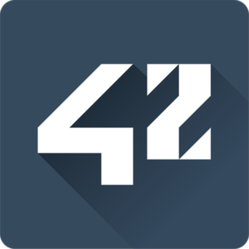
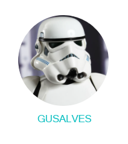
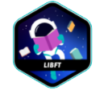
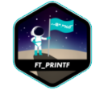

	

	A 42 é uma escola privada, sem fins lucrativos e gratuita de programação (engenharia de software).
	A formação é inspirada por novas formas modernas de ensino que incluem pedagogia peer-to-peer e aprendizagem baseada em projetos.

# Meu progresso

	
	

	
	

	h2>Projetos realizados:</h2>

	
	

	

